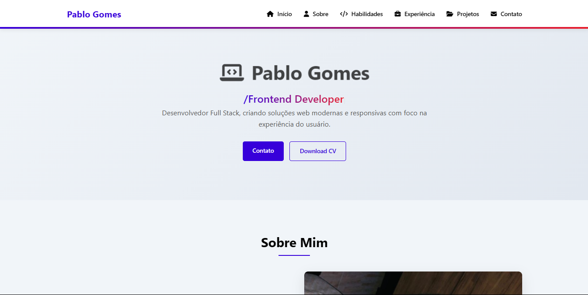

  

  

## 🌟 Sobre Mim <=

👨‍💻 Sou um desenvolvedor em formação de ads, apaixonado por tecnologia e sempre em busca de aprender coisas novas. Atualmente, estou explorando o mundo full-stack e contribuindo para projetos open-source. Meu objetivo é me tornar um desenvolvedor completo e criar soluções que impactem positivamente a vida das pessoas. 

 

    

 

## 🧠 Conhecimentos que estou dominando e evoluindo

  
  &nbsp;
  
  &nbsp;
  
  &nbsp;
  
  &nbsp;
  
  &nbsp;
  
  &nbsp;
  
  &nbsp;
  

 

    

 

 

    

 

<h3 align="center">✨ Projetos em Destaque</h3>

**[UserFlow Backend](https://github.com/PabloG-7/userflow-backend)**  
Um backend em Node.js e MySQL para gerenciar usuários e comentários.  
Tecnologias: Node.js, Express, MySQL.

  

**[Portfolio 2025](https://pablog-7.github.io/new-portfolio/)**  
Meu portfólio pessoal, mostrando meus projetos e habilidades.  
Tecnologias: HTML, CSS, JavaScript.

  

**[LuckPet - PetShop](https://pablog-7.github.io/ecommerce-luckpet/)**  
Projeto de e-commerce focado em produtos para pets.  
Tecnologias: HTML, CSS, JavaScript.

 

    

 

## 📫 Como Me Encontrar }

- Email: pablooliver853@gmail.com
- LinkedIn: [linkedin.com/in/pablo-gomes](https://www.linkedin.com/in/pablogomess/)
- GitHub: [github.com/PabloG-7](https://github.com/PabloG-7)
- Portfólio: [github.com/PabloG-7](https://pablog-7.github.io/meu-portifolio/)

 

    

 

## 📌 Curiosidades {}

- 🎮 Gosto de jogos e sou fã de RPGs.
- 📚 Adoro ler sobre tecnologia e desenvolvimento pessoal.
- 🚴‍♂ Nas horas vagas, gosto de programar e explorar novos lugares.

 

    

 

## 💡 Inspiração

> "O sucesso é a soma de pequenos esforços repetidos dia após dia." – Robert Collier

 

    

 

Feito com ❤ por [Pablo Gomes de Oliveira](https://github.com/PabloG-7)
