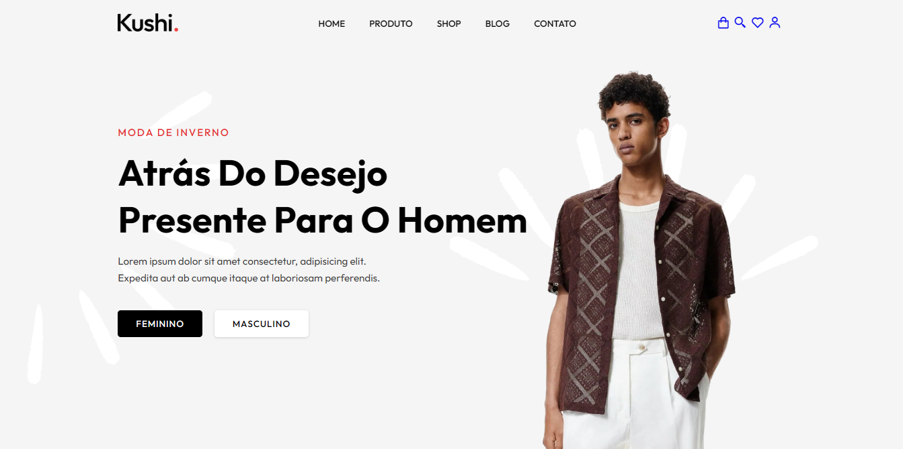

  

  

## 🌟 Sobre Mim <=

= 👨‍💻 Eu sou um desenvolvedor Full-Stack
- 🎓 Em formação de Análise e Desenvolvimento de Sistemas
- 🎮 Gosto de jogos competitivos.
- 📚 Adoro ler sobre tecnologia e desenvolvimento pessoal.
- 🚴‍♂ Nas horas vagas, gosto de programar e explorar novos lugares.

 

    

 

## 🧠 Conhecimentos que estou dominando e evoluindo

  
  &nbsp;
  
  &nbsp;
  
  &nbsp;
  
  &nbsp;
  
  &nbsp;
  
  &nbsp;
  
  &nbsp;
  
  &nbsp;
  

 

    

 

<h2 align="center">🚀 Projetos em Destaque {</h2>

  

    
    

      <b>UserFlow Backend</b> 
      Backend em Node.js e MySQL para gerenciar usuários e comentários. 
      <i>Tecnologias: Node.js, Express, MySQL.</i> 
      🌐 <a href="https://github.com/PabloG-7/userflow-backend" target="_blank">Ver Site</a> -
      🔗 <a href="https://github.com/PabloG-7/userflow-backend" target="_blank">Ver Código</a>
    

  

  

    
    

      <b>Executive Insight Dashboard</b> 
      Um dashboard executivo moderno e responsivo, projetado para impressionar CEOs e gestores com visualizações de dados claras e impactantes. 
      <i>Tecnologias: HTML & CSS, JavaScript.</i> 
      🌐 <a href="https://pablog-7.github.io/executive-insight-dashboard/" target="_blank">Ver Site</a> -
      🔗 <a href="https://github.com/PabloG-7/executive-insight-dashboard" target="_blank">Ver Código</a>
    

  

  

    
    

      <b>LuckPet - PetShop</b> 
      Um projeto completo de e-commerce para PetShop. 
      <i>Tecnologias: HTML & CSS, JavaScript.</i> 
      🌐 <a href="https://pablog-7.github.io/ecommerce-luckpet/" target="_blank">Ver Site</a> -
      🔗 <a href="https://github.com/PabloG-7/ecommerce-luckpet" target="_blank">Ver Código</a>
    

  

  

    
    

      <b>Kushi - E-commerce de Moda</b> 
      Site de e-commerce especializado em moda masculina e feminina, com foco em estilo, qualidade e descontos sazonais. 
      <i>Tecnologias: HTML & CSS, JavaScript.</i> 
      🌐 <a href="https://pablog-7.github.io/ecommerce-kushi/" target="_blank">Ver Site</a> -
      🔗 <a href="https://github.com/PabloG-7/ecommerce-kushi" target="_blank">Ver Código</a>
    

  

 

    

 

 

    

 

## 📫 Como Me Encontrar }

  
  &nbsp;&nbsp;
  
  &nbsp;&nbsp;
  

 

    

 

## 💡 Inspiração ;}

> "O sucesso é a soma de pequenos esforços repetidos dia após dia." – Robert Collier

 

    

 

Feito com ❤ por [Pablo Gomes de Oliveira](https://github.com/PabloG-7)
